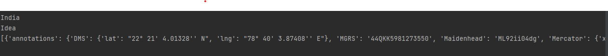

# Project Name

- Mobile Number Tracking 

Project Structure:- 

- main.py (main file to access the live location from user)
- myphone (number)
- static (directory for images access)

project root :- we will trace phone number live location,
in world. 

1) Annotations:- output like lat,lang,operator name
and operator country location:- 

2 Out:- 

3) Out of lat and lng :-

4) final output on map:- 

Note:- finally we can find our user location on google map
using lat and lng function in map 

